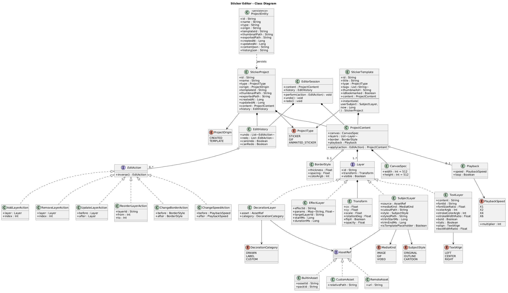
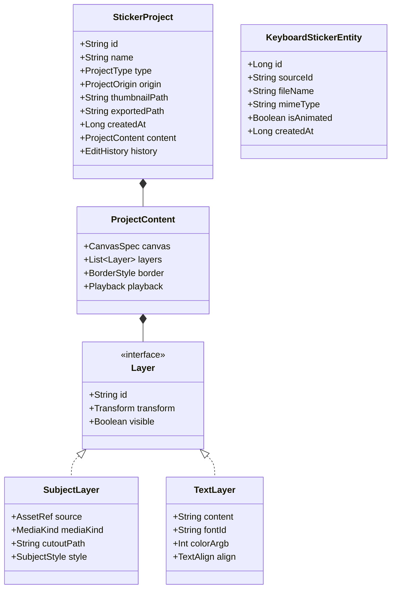

# 🎨 Stickify - Custom Sticker & GIF Creator + Custom Keyboard for Android

<p align="center">
  
</p>

<p align="center">
  <a href="#"></a>
  <a href="#"></a>
  <a href="#"></a>
  <a href="#"></a>
  <a href="#"></a>
  <a href="#"></a>
</p>

---

## 🚀 Giới thiệu (Overview)

**Stickify** là một ứng dụng Android hiện đại, toàn diện cho phép người dùng tự thiết kế nhãn dán (**Stickers**), tạo nhãn dán chuyển động (**Animated WebP / GIF**), quản lý bộ sưu tập và gửi nhãn dán trực tiếp thông qua **Bàn phím tùy chỉnh (`InputMethodService`)** vào các ứng dụng tin nhắn phổ biến như **Zalo, Messenger, WhatsApp, Telegram**.

Ứng dụng tích hợp công nghệ **Trí tuệ nhân tạo (Google ML Kit AI)** để tự động tách nền ảnh thần tốc, kết hợp với bộ công cụ chỉnh sửa chuyên nghiệp và thuật toán nén **Animated WebP Muxer** thuần Kotlin độc quyền.

---

## ✨ Tính năng nổi bật (Key Features)

### 1. ✂️ Tách nền thông minh bằng AI (AI-Powered Cutout)
- Sử dụng **Google ML Kit Subject Segmentation** để tự động nhận diện và tách chủ thể (người, thú cưng, vật thể) ra khỏi ảnh chỉ trong vài miligiây.
- Hỗ trợ xem trước đường viền phác thảo (`ContourOverlayView`) và chỉnh sửa vùng chọn linh hoạt.

### 2. 🎨 Trình biên tập Sticker chuyên nghiệp (Advanced Sticker Editor)
- **Tạo viền Sticker chuẩn xác**: Tự động tính toán đường viền trắng (`StickerStyleProcessor`) với hiệu ứng tạo bóng (shadow) mượt mà.
- **Bộ lọc hoạt hình (Cartoonify)**: Chuyển đổi ảnh chụp thành phong cách hoạt hình ấn tượng.
- **Trang trí & Chữ (Decor & Text Layers)**: Thêm văn bản đa dạng phông chữ, biểu tượng cảm xúc, hình vẽ cọ và nhãn dán trang trí.
- **Quản lý Layer & Undo/Redo**: Hệ thống `EditorSession` và `EditHistory` hỗ trợ thao tác hủy/làm lại không giới hạn theo mô hình Action Pattern.

### 3. 🎬 Động hóa Sticker & Xuất file Animated WebP (Animated Sticker Engine)
- Bộ hiệu ứng chuyển động đa dạng: **Bounce (Nhún nhảy)**, **Shake (Rung lắc)**, **Spin (Xoay 360°)**, **Pulse (Co giãn)**, **Wobble (Lắc lư)**.
- **Thuật toán Animated WebP Encoder độc quyền**: Viết bằng thuần Kotlin (`AnimatedWebPEncoder.kt`), tự động đóng gói các frame `VP8L` thành file **Animated WebP (`.webp`)** với **kênh Alpha nền trong suốt tuyệt đối (`Color.TRANSPARENT`)**.
- Tự động lọc & xử lý khử sạch nền đen xung quanh bằng thuật toán **Flood Fill** thông minh (`ImageUtils.makeBlackBackgroundTransparent`).

### 4. ⌨️ Bàn phím Sticker Tùy chỉnh (`StickifyKeyboardService`)
- Tích hợp dịch vụ bàn phím ảo Android (`InputMethodService`) hoàn chỉnh:
  - **Bàn phím gõ chữ QWERTY**: Đầy đủ các hàng số, chữ cái, phím cách, Shift, Backspace, Enter.
  - **Thanh công cụ Top Bar**: Nút chuyển đổi nhanh, hiển thị ô xem trước sticker mới nhất.
  - **Bảng chọn Sticker 2 cột**: Lưới cuộn dọc mượt mà chứa tất cả các sticker/GIF đã lưu.
  - **Truyền nội dung trực tiếp (`commitContent`)**: Gửi sticker/GIF trực tiếp vào ô chat của Zalo, Messenger, WhatsApp bằng `InputConnectionCompat` và `FileProvider`.

### 5. 🛍️ Quản lý Bộ sưu tập & Preview sống động
- Màn hình xem trước **StickerPreviewActivity** với hiệu ứng nảy (`OvershootInterpolator`) 1.5s và animation bay vào bàn phím (Fly-to-Target).
- Quản lý danh sách sticker yêu thích, tạo và phân loại các gói sticker (Sticker Packs).
- Dialog nâng cao hướng dẫn người dùng kích hoạt bàn phím hệ thống (`EnableKeyboardDialogFragment`).

---

## 🛠️ Kiến trúc & Công nghệ (Architecture & Tech Stack)

Dự án được xây dựng dựa trên các chuẩn mực mới nhất của phát triển ứng dụng Android hiện đại (**Modern Android Development - MAD**):

| Tầng / Thành phần | Công nghệ / Thư viện sử dụng |
| :--- | :--- |
| **Language** | 100% Kotlin |
| **Architecture** | Clean Architecture (Domain, Data, Presentation) + MVVM |
| **Dependency Injection** | Hilt (Dagger Hilt 2.57.1) |
| **Async & Reactive** | Kotlin Coroutines + Flow / StateFlow / LiveData |
| **Local Database** | Room Database 2.6.1 + TypeConverters |
| **AI / Machine Learning** | Google ML Kit Subject Segmentation (`16.0.0-beta1`) |
| **Network & Serializer** | Ktor Client 3.0.0 (Gson & Json Content Negotiation) |
| **Image & Animation** | Glide 4.16.0, Lottie 6.4.0, Custom Pure Kotlin WebP & GIF Encoders |
| **UI Component** | Material Design 3, ViewBinding, DataBinding, Custom Views |

---

## 📐 Sơ đồ kiến trúc dữ liệu (Class Diagram)

Chi tiết thiết kế mô hình dữ liệu chính của hệ thống (tham khảo từ [`docs/db.txt`](docs/db.txt)):



---

## 📁 Cấu trúc thư mục dự án (Project Structure)

```text
Stickify/
├── app/src/main/
│   ├── java/com/jetpack/stickify/
│   │   ├── data/
│   │   │   ├── gif/                 # Encoder Animated WebP (AnimatedWebPEncoder) & GIF
│   │   │   ├── processor/           # Thuật toán xử lý viền, hoạt hình (StickerStyleProcessor)
│   │   │   ├── repository/          # Triển khai các Repository (KeyboardSticker, Sticker, Project)
│   │   │   └── source/local/        # Room Database, DAO, Entities & TypeConverters
│   │   ├── di/                      # Dagger Hilt Modules (DatabaseModule, RepositoryModule)
│   │   ├── domain/
│   │   │   ├── model/               # Model doanh nghiệp (StickerProject, Layer, Entity)
│   │   │   ├── repository/          # Interface định nghĩa Repository
│   │   │   └── usecase/             # Các UseCase chính (AddStickerToKeyboard, ExportGif, v.v.)
│   │   └── presentation/ui/
│   │       ├── collection/          # Quản lý gói sticker, yêu thích (CollectionFragment)
│   │       ├── cut_image/           # Màn hình tách nền AI (CutoutActivity)
│   │       ├── edit_sticker/        # Trình chỉnh sửa Sticker & Preview (StickerEditActivity, Preview)
│   │       ├── home/                # Màn hình trang chủ (HomeActivity, HomeFragment)
│   │       └── keyboard/            # Bàn phím tùy chỉnh hệ thống (StickifyKeyboardService)
│   ├── res/                         # Tài nguyên XML, Layouts, Drawables, Values & Navigation
│   └── AndroidManifest.xml          # Đăng ký Bàn phím Service, FileProvider & Activities
└── docs/                            # Tài liệu kiến trúc & Hình ảnh sơ đồ (img.png, db.txt)
```

---

## 🔧 Cài đặt & Hướng dẫn sử dụng (Setup & Run)

### Yêu cầu môi trường (Prerequisites)
- **Android Studio**: Ladybug / 2024.1+ hoặc Android Studio Meerkat 2026.1+
- **JDK**: Java 11
- **Android SDK**: Compile SDK 36, Target SDK 36, Minimum SDK 24 (Android 7.0 Nougat)

### Các bước biên dịch (Build Steps)
1. Clone dự án về máy cục bộ:
   ```bash
   git clone https://github.com/your-username/Stickify.git
   cd Stickify
   ```
2. Mở dự án trong **Android Studio**.
3. Chờ Gradle thực hiện Sync dependencies.
4. Chạy lệnh Build Debug APK qua Gradle Wrapper:
   ```bash
   ./gradlew assembleDebug
   ```
5. Kết nối thiết bị Android hoặc Emulator và bấm **Run `app`**.

---

## 📱 Hướng dẫn kích hoạt Bàn phím Stickify

1. Sau khi cài đặt ứng dụng, mở **Stickify** và chọn **Cài đặt ngay** trên hộp thoại yêu cầu kích hoạt.
2. Trong **Cài đặt hệ thống Android** $\rightarrow$ **Ngôn ngữ & Nhập liệu** $\rightarrow$ **Quản lý bàn phím ảo**:
   - Gạt bật **Stickify**.
3. Mở **Zalo**, **Messenger** hoặc **WhatsApp**, chạm vào ô tin nhắn, bấm vào biểu tượng bàn phím 🌐 ở góc dưới màn hình và chọn **Stickify**.
4. Giờ đây bạn có thể chọn và gửi bất kỳ nhãn dán tĩnh hoặc WebP động nào đã tạo!

---

## 📄 Giấy phép (License)

Dự án được phân phối dưới giấy phép open-source **MIT License**. Bạn có thể tự do tham khảo, chỉnh sửa và đóng góp cho dự án.

---

<p align="center">
  Developed with ❤️ by Android Developer
</p>
